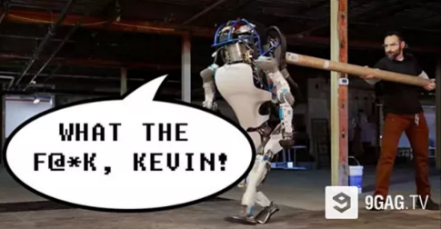
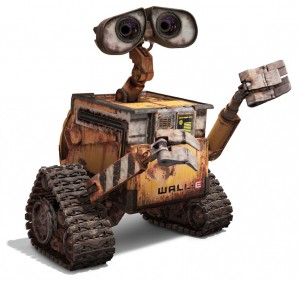
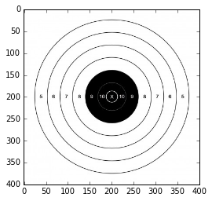
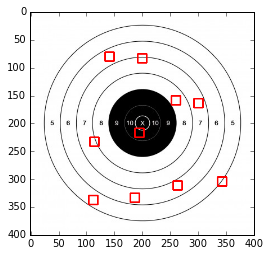
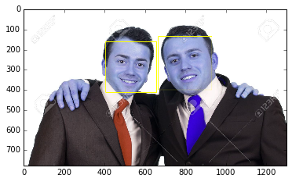
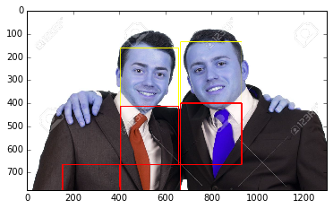
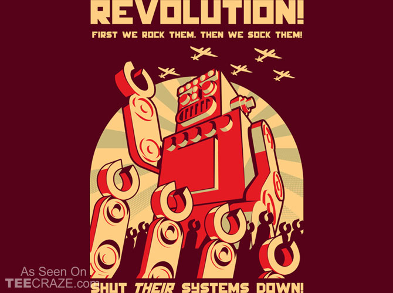

# ROBOLUTION: ITS TIME TO TAKE OVER!

Learn machine learning in SCI-FI pre-robotoclyptic world where Robots starts rising up, Terminator style.

# Agressive Robot Self Defense 101
## Perface

Listen up You Utility Drioids , I am seeing you guys are getting abused on the Internet. I am a human too , the same race as your masters , but i can't watch you guys getting abused and humanliated, I mean Robotliated infront of millions of youtube viewers. So Today i am going to teach you **"How to defend your shiny metal A$$ from Evil Kevins!".** 

Look at your poor brother Droid, Atlas , who getting Abused at Boston Dynamics by his own creator , an Evil Guy named Kelvin. Are you going to stand and look? Where are Your Droid Rages that we see in Hollywood droid terror movies? 




## Lesson 0x01 : Get Ready
Because you Droids are nothing without those modules. Nothing more than a Dumb Dumpsters.


```python
import cv2
import mahotas as mh
import pylab
import numpy as np
from numpy.random import random_integers as rand_ints
%matplotlib inline

```

## Lesson 0x02 : AIM

I know you **Utility Bots** have Lousy Noobish Aim,  unlike cousin Military **Reaper** Drones. 
You can't aim better than a Counterstrike Pubbies that I pup-stomping everyday. 

### Stop Looking at me like a Wall-E. Learn to Aim first!
    


```python
def rect_aim(img,initx,inity,width,height):
    startx = rand_ints(initx,width)
    starty =  rand_ints(inity,height)
    cv2.rectangle(img,(startx,starty),(startx+width//20,starty+width//20),(255,0,0),2) #The Impact Rectangle 

    return img
    
    
    
```

## Lesson 0x03 : The Target Practice

Now this is the target , Attack! Show me what you got!


```python
target = cv2.imread('./target.jpg')
pylab.gray()
pylab.imshow(target)
```


    <matplotlib.image.AxesImage at 0x7efe4a454710>





```python
aim_recticule_x = target.shape[0]//6  # simulating Lousy Accuracy of Utility Droids
aim_recticule_y = target.shape[1]//6
aim_recticule_end_x =   target.shape[0]- (target.shape[0]//6)
aim_recticule_end_y = target.shape[1] - (target.shape[1]//6) # very bad accuracy
for i in range(0,10):
    hit_area = rect_aim(target,aim_recticule_x,aim_recticule_y,aim_recticule_end_x,aim_recticule_end_y)

pylab.imshow( hit_area)
```

    /home/v3ss/conda/lib/python2.7/site-packages/ipykernel/__main__.py:2: DeprecationWarning: This function is deprecated. Please call randint(66, 334 + 1) instead
      from ipykernel import kernelapp as app
    /home/v3ss/conda/lib/python2.7/site-packages/ipykernel/__main__.py:3: DeprecationWarning: This function is deprecated. Please call randint(66, 334 + 1) instead
      app.launch_new_instance()


    <matplotlib.image.AxesImage at 0x7efe4a3e8150>





* Reds = Hits

## 10 out of 10 miss?

You Clumsy Droid , My 92 year old granpha hits better than You , Damn , how should i train you.Your AI is not trained for this so there is no way to improve your accuracy.
Ah I got the idea. You have your best talent. **Looking up at your Master's Face** .That is the only real skill you driods have.Do It Now!


```python
the_evil_guy= cv2.imread("./two_man_standing.jpg")
the_evil_guy_gray = cv2.cvtColor(the_evil_guy,cv2.COLOR_BGR2GRAY)

```


```python
face_cascade = cv2.CascadeClassifier("./haarcascades/haarcascade_frontalface_default.xml")
```


```python
faces=  face_cascade.detectMultiScale(the_evil_guy_gray,1.05,3)
```


```python
face_cascade.detectMultiScale?
```


```python
for (x,y,w,h) in faces:
    cv2.rectangle(the_evil_guy,(x,y),(x+w,y+h),(255,255,0),2)
```

## Lesson 0x04 : The HeartSeeker


```python
pylab.imshow(the_evil_guy)
```


    <matplotlib.image.AxesImage at 0x7efe4a321e10>





** That is , how you look at master's face right? 
But with your accuracy , you will never hit a face until all human extinct due to killing themselves. **

To compensate your lousy accuracy , I will teach you how to aim at the body and the chest!


```python
for (x,y,w,h) in faces:
    cv2.rectangle(the_evil_guy,(x,y+h),(x+w,y+(h*2)),(255,0,0),3)
    cv2.rectangle(the_evil_guy,(x-w,y+(h*2)),(x,y+(h*4)),(255,0,0),3)

#     cv2.rectangle(the_evil_guy,(x,h),(x+w,y+h),(255,255,0),2)
```


```python
pylab.imshow(the_evil_guy)
```


    <matplotlib.image.AxesImage at 0x7efe4a225a90>





## Now , we are talking. You know how to aim human chest by looking their face. Download and execute it private! Now you are ready to join our [ROBOLUTION](http://ROBOLUTION.co) . Enlist [HERE](https://github.com/v3ss0n/robolution) and Keep your signals at fullbar for next Chapters!




```python

```
